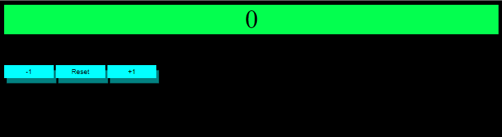

# counter
this is a counter application that can be used to add or subtract in 1, 5 or 10   number increments.

## Getting Started

you can view the the counter here:
https://evohat3.github.io/counter

## Built With

Html, Css and Javascript
**************************************************************
## Updates
**************************************************************
### 1.1

* added content to README file

* updated the buttons to reflect (-,+) 10 buttons and (-,+) 5 buttons

* added new styling to make the buttons look more like buttons

* added visual hover elements to all the buttons

**************************************************************
### 1.0 

* created Counter App with +1 -1 and a reset button

